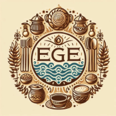
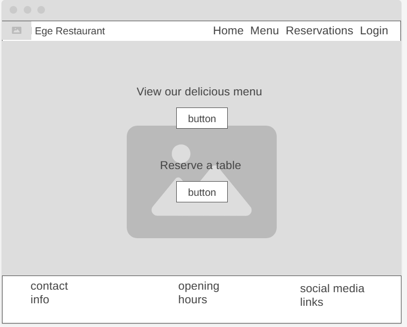
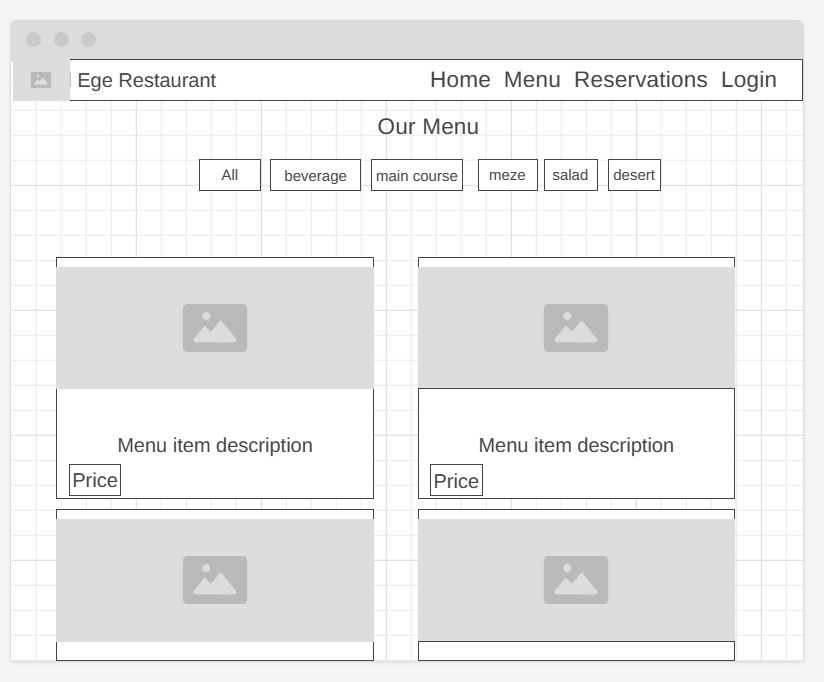
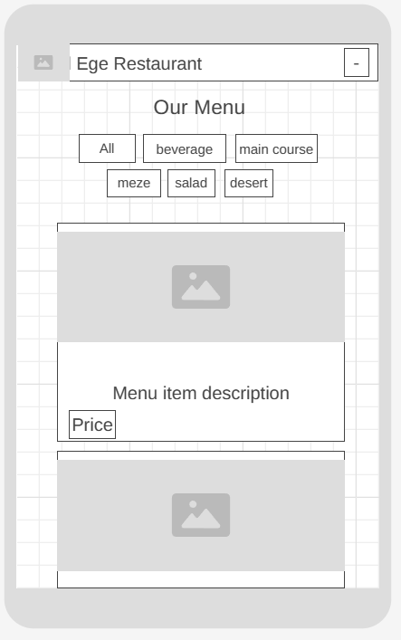
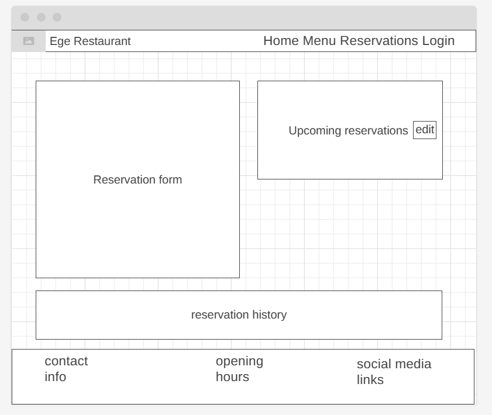
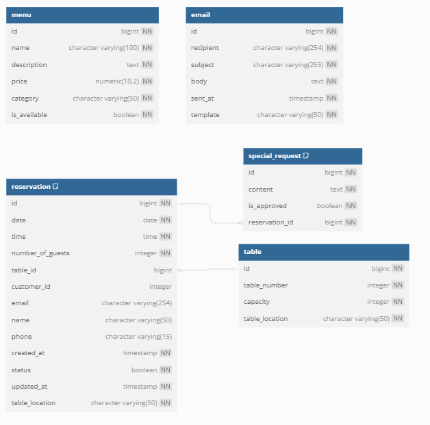

# Ege Restaurant

### My Girlfriends Dream Restaurants Website


Portfolio 4 project as part of the Diploma in Full Stack Software Development by Code Institute.
___

It is a fullstack restaurant website that showcases the menu and allows users to create an account, make and edit reservations.

Link to live site - [Ege Restaurant Deployed link](https://ege-restaurant-9c7a6a3b1543.herokuapp.com/)

## CONTENTS

- [Ege Restaurant](#ege-restaurant)
    - [My Girlfriends Dream Restaurants Website](#my-girlfriends-dream-restaurants-website)
  - [CONTENTS](#contents)
  - [Site Objectives](#site-objectives)
- [Design Choices](#design-choices)
  - [Colour Scheme](#colour-scheme)
  - [Typography](#typography)
  - [Logo and Favicon](#logo-and-favicon)
  - [Wireframes](#wireframes)
  - [Flow Diagram](#flow-diagram)
  - [Database Plan](#database-plan)
- [Features](#features)
  - [Registration](#registration)
  - [Future Features](#future-features)
  - [Features Not Included](#features-not-included)
- [Technologies Used](#technologies-used)
- [Programming Languages, Frameworks and Libraries Used](#programming-languages-frameworks-and-libraries-used)
- [Agile](#agile)
- [Testing](#testing)
  - [Manual Testing](#manual-testing)
  - [User](#user)
  - [Bugs](#bugs)
  - [Lighthouse](#lighthouse)
  - [Validation Testing](#validation-testing)
    - [HTML \& CSS](#html--css)
  - [Python Testing](#python-testing)
  - [Deployment](#deployment)
    - [Github Deployment](#github-deployment)
    - [Creating a Fork](#creating-a-fork)
    - [Cloning](#cloning)
    - [Repository deployment-Heroku](#repository-deployment-heroku)
    - [Deployment of the app](#deployment-of-the-app)
  - [Credits](#credits)
  - [Media](#media)
  - [Acknowledgments](#acknowledgments)

___

## Strategy Plane

The core objective for Ege Restaurant's website is to enhance the dining experience by enabling customers to make detailed reservations easily, view the menu, and interact with the restaurant efficiently online. This project aims to provide a seamless reservation system, showcase the restaurant's menu, and enable the admin to manage reservations and menu items effectively.

### Target Audience

-  Individuals who are seeking a high-quality Mediterranean dining experience in Cyprus. Anyone looking to make online reservations for this restaurant. 
- Restaurant owners

### Site Goals

-  Develop a user-friendly website that allows for easy navigation and interaction.
-  Implement an efficient online reservation system that simplifies the booking process for customers.
-  Showcase the restaurant's Mediterranean cuisine through a detailed and visually appealing menu.
-  Provide the restaurant's administration with tools to manage reservations, menu items, and customer interactions effectively.

## Scope Plane

Focusing on essential features that need to be implemented for a functional and effective website, we categorize them into must-have and nice-to-have, guided by MoSCoW prioritization.

### Necessary Features (Must-Have):
User authentication for reservation management.
A dynamic reservation system that allows customers to book tables online.
A comprehensive menu display, including descriptions and images of the dishes.
An admin dashboard for managing reservations, menu items, and viewing reservation statistics.

### Nice-to-Have Features:
Notification system for reservation actions.
Email SMTP setup for sending confirmation and promotional emails.
Waiting list functionality for fully booked dates.
Special request management during the reservation process.

## Structure Plane
With the features defined, I have outlined the user stories, mapping out the interactions users will have with the website. A more detailed version of these user stories can be found here. [Issues page of Ege Restaurant github](https://github.com/redifo/ege-restaurant/issues)

### User Authentication

| User Story                                                                                                           | Priority       |
|----------------------------------------------------------------------------------------------------------------------|----------------|
| As a new user, I want to register on the website, so I can manage my reservations.                 | **MUST HAVE**  |
| As an existing user, I want to log in and out of my account, to access my dashboard.         | **MUST HAVE**  |

### Reservation Management

| User Story                                                                                                           | Priority       |
|----------------------------------------------------------------------------------------------------------------------|----------------|
| As a user, I want to make a reservation, to ensure I have a table.                | **MUST HAVE**  |
| As a user, I want to view, update, and cancel my reservations, for flexibility.         | **MUST HAVE**  |
| As a user, I want to select a specific seat or area, for a personalized experience.         | **SHOULD HAVE**  |
| As a user, I want to be notified of reservation actions, for up-to-date information.        | **COULD HAVE**  |

### Menu Interaction

| User Story                                                                                                           | Priority       |
|----------------------------------------------------------------------------------------------------------------------|----------------|
| As a user, I want to browse the menu, to explore the dishes offered.                | **MUST HAVE**  |
| As an admin, I want to manage menu items, to keep the menu current.        | **SHOULD HAVE**  |

### Additional Features

| User Story                                                                                                           | Priority       |
|----------------------------------------------------------------------------------------------------------------------|----------------|
| As a user, I want to join a waiting list, for the opportunity to dine on busy days.               | **COULD HAVE**  |
| As a user, I want to make special requests with my reservation, for customized service.       | **COULD HAVE**  |

### New Visitor Goals

- Quickly grasp what the site and content is about.
- Navigate the website effortlessly to explore menu options and reservation details.
- Register for an account to manage reservations and receive updates.

### Existing Visitor Goals

-  Log into their account seamlessly.
-  Review their reservation history and manage future reservations.

# Design Choices

## Colour Scheme

#F1DFA2 (Cream): This soft cream color forms the background of various sections, offering a warm and inviting ambiance that's easy on the eyes.
#FCF6E4 (Off-White): Used for background highlights and to create a clean, uncluttered look, enhancing the content's readability.
Accent Colours:
#F8DA2E (Sunflower Yellow): Used for menu title to draw attention.
#519CEB (Sky Blue): Indicates active page links and button hovers, adding a refreshing contrast against the warmer tones.
Text:
#000000 (Black): Provides excellent readability against the lighter background shades, used for the majority of the text.
This colour scheme was selected to balance warmth and energy, creating an inviting digital environment that's both aesthetically pleasing and functional. The use of contrasting colours for interactive elements ensures users can easily navigate and interact with the website.

## Typography

For the website, I chose two main fonts to make it look modern and easy to read. I used 'Work Sans' for the main text because it's clean and straightforward, which helps with reading on screens. Then, for the titles in the footer, I picked 'Dancing Script' because it's a bit more decorative and adds some personality, especially for important sections. These choices help make the site feel welcoming and easy to navigate.

## Logo and Favicon

Logo is generated by dalle-3 using the prompt :  "generate a logo for a mediterranean  restaurant, the name of the restaurant is ege"

Favicons created using: https://favicon.io/favicon-converter/



## Wireframes

Wireframes were created for mobile and desktop using [wireframe.cc](https://wireframe.cc/). For other devices wireframes were not seen as a necessity. Wireframes for other pages were not developed before development.







## Flow Diagram

## Database Plan

The database for the restaurant website consists of four main models: Table, Reservation, SpecialRequest, and MenuItem, along with an Email model for managing emails. Although the email setup could not implemented for the project submission due to time constraints.

Table: Represents restaurant tables, specifying their number, capacity, and location (Garden, Bar, or Dining Room). This helps manage seating arrangements.
Reservation: Links customers (registered or not) to table bookings, recording details like email, phone, name, date, time, number of guests, and table location. It allows for tracking both pending and confirmed reservations.
SpecialRequest: Captures any special requests associated with a reservation, noting if it's approved. This enhances customer service by attending to specific needs.
MenuItem: Details the food items on the menu, categorized by type (e.g., Starter, Meze, Main Course), including descriptions, prices, availability, and images. This model aids in menu management and presentation.
Email: Handles the creation of emails for different purposes, with fields for recipient, subject, body, and template type, automating communication with customers.

The database diagram was created using https://dbdiagram.io/.



# Features

## Registration

## Menu

## Reservations

## Future Implementations

### Accessibility

I have been mindful during coding to ensure that the website is as accessible friendly as possible. This has been have achieved by:

* Giving all buttons a hover state to enhance the user experience by making the navigation elements responsive, ensuring that users are aware of clickable elements and encouraging engagement with the website's content.
* Choosing a sans serif font for the website - sans serif fonts are known by their easy readability.
* Making sure that there is sufficient colour contrast.

## Technologies Frameworks, Libraries & Programs Used

### Frameworks, Libraries and packages
*  [django]()
*  [Bootstrap v4.6.2]()
*  [JQuery v3.7.1]()
*  [isotope]()
*  [fontawesome]()
*  [gunicorn](https://pypi.org/project/gunicorn/) - Python WSGI HTTP Server for UNIX.
*  [psycopg2](https://pypi.org/project/psycopg2/) - PostgreSQL database adapter.
*  [whitenoise](https://pypi.org/project/whitenoise/) - static file serving for Python web apps.
*  [django-allauth](https://docs.allauth.org/en/latest/) - authentication, registration, account management.
*  [cloudinary](https://pypi.org/project/cloudinary/) -  Image storage.

### Other Programs Used

* [wireframe.cc](https://wireframe.cc/) - Used to create wireframes.

* [Bing.com Dall-e](https://www.bing.com/images/create/?ref=hn) - Used to create all the images within the website except menu items.

* [Git](https://git-scm.com/) - For version control.

* [Github](https://github.com/) - To save and store the files for the website.

* [Google Fonts](https://fonts.google.com/) - To import the fonts used on the website.

* [Google Developer Tools](https://developers.google.com/web/tools) - To troubleshoot and test features, solve issues with responsiveness and styling.

* [Favicon.io](https://favicon.io/) To create favicon from the logo created by Dall-e 3.

* [Canva.com](https://www.canva.com/) To edit some of the images generated by dalle-3.
  
* [convertio.co](https://convertio.co) To covert images into webp format.

* [Am i responsive](https://ui.dev/amiresponsive) to create the responsive mockup view.

* [Webpage Spell-Check](https://chrome.google.com/webstore/detail/webpage-spell-check/mgdhaoimpabdhmacaclbbjddhngchjik/related) - a google chrome extension that allows you to spell check your webpage. Used to check the site and the readme for spelling errors.

- - -
# **Testing**

Please refer to the separate [TESTING.md](TESTING.md) file.

# **Deployment**

Here is the link to the deployed project. [Ege Restaurant Deployed link](https://ege-restaurant-9c7a6a3b1543.herokuapp.com/).

## **Create Repository**

First, create a new repository on GitHub. i have used the [Code Institute Template](https://github.com/Code-Institute-Org/ci-full-template). 

If working locally, set up a virtual environment and open your project in your IDE. For virtual environment setup, you can use the command python -m venv .venv.

## **Project Setup**

Below, I have mentioned the versions of the libraries used to prevent any version incompability issues .

1. Install **Django** and **gunicorn**:
   - `pip install Django==5.0.3 gunicorn==20.1.0`
2. Install supporting **libraries**:
   - `pip install dj-database-url==0.5.0`
   - `pip install cloudinary~=1.36.0 dj3-cloudinary-storage~=0.0.6 urllib3~=1.26.15`
   - `pip install psycopg2==2.9.9`
   - `pip install django-allauth==0.57.2`
   - `pip install django-summernote==0.8.20.0`
   - `pip install whitenoise==5.3.0`
3. Create **requirements.txt** file:
   - `pip freeze --local > requirements.txt`
4. Create a Django project:
   - `django-admin startproject your_project_name` 
5. Run the local server
   - `python manage.py runserver`
   
## **Database Setup**

For the database, I am using PostgreSQL through ElephantSQL: [ElephantSQL](https://www.elephantsql.com/).

1. Log in to your account
2. Create an instance on ElephantSQL and obtain the database URL.

## **Cloudinary Setup**

1. For Cloudinary, sign up and obtain your Cloudinary URL for media management. [Cloudinary](https://cloudinary.com/)  **API Environment variable**

## **File Changes**

In settings.py, configure your database, static files, and Cloudinary settings. Include your database URL, Cloudinary URL, and secret key in your environment variables. Set up STATICFILES_STORAGE to use whitenoise for static file management. Don't forget to configure AUTHENTICATION_BACKENDS to include both Django's default and allauth's authentication backends.

1. Although if you copy directly from my githuib repository the settings.py should come with all the changes i made, i wanted to document my changes. Changes I made in the default **settings.py** file: 
```    
import os
import dj_database_url
if os.path.isfile('env.py'):
    import env

#Got the idea of automatic debug value setting from my mentor Jubril
try:
    from env import DEBUG_DEV
except ImportError:
    DEBUG_DEV = False 

DEBUG = DEBUG_DEV

BASE_DIR = Path(__file__).resolve().parent.parent
SECRET_KEY = os.environ.get("SECRET_KEY")

#allowed hosts for local ide and heroku deployment
ALLOWED_HOSTS = ['.herokuapp.com',
                 '127.0.0.1',]

#https://docs.allauth.org/en/latest/account/advanced.html
#settings Used for email login with allauth

ACCOUNT_EMAIL_VERIFICATION = 'none'
ACCOUNT_AUTHENTICATION_METHOD = 'email'
ACCOUNT_EMAIL_REQUIRED = True
ACCOUNT_USERNAME_REQUIRED = False

STATIC_URL = '/static/'
STATICFILES_DIRS = [os.path.join(BASE_DIR, 'static'),]
STATIC_ROOT = os.path.join(BASE_DIR, 'staticfiles')

STATICFILES_STORAGE = 'whitenoise.storage.CompressedManifestStaticFilesStorage'
DATABASES = {
    'default': dj_database_url.parse(os.environ.get("DATABASE_URL"))
}

#https://haiiiiiyun.github.io/django__Create_email_login_authentication_with_django-allauth_in_Django/

#Don't forget to configure AUTHENTICATION_BACKENDS to include both Django's default and allauth's authentication backends.

AUTHENTICATION_BACKENDS = [
    'django.contrib.auth.backends.ModelBackend',  
    'allauth.account.auth_backends.AuthenticationBackend',
]

#check your installed app settings against my settings
INSTALLED_APPS = [
    'django.contrib.admin',
    'django.contrib.auth',
    'django.contrib.contenttypes',
    'django.contrib.sessions',
    'django.contrib.messages',
    'django.contrib.staticfiles',
    'cloudinary_storage',
    'django.contrib.sites',
    'allauth',
    'allauth.account',
    'allauth.socialaccount',
    'django_summernote',
    'menu',
    'reservations',
    'home',
    'django_rename_app',
    'cloudinary',
    'notifications',
    ]

#Templates directory code change
TEMPLATES_DIR = os.path.join(BASE_DIR, 'templates')
TEMPLATES = [
    {
        'BACKEND': 'django.template.backends.django.DjangoTemplates',
        'DIRS': [TEMPLATES_DIR],
        .
        .
        .
        },
]
```   

2. Create a **env.py** file in your main directory copy the contents below into your file. Make sure the file is added to *.gitignore*:
    ```
    import os

    DEBUG_DEV=True

    os.environ.setdefault("DATABASE_URL", "Your_url")

    os.environ.setdefault("SECRET_KEY", "Your_url")

    os.environ.setdefault("CLOUDINARY_URL", "Your_url")
    ```
3. After these changes, run `python manage.py migrate` to migrate your database structure to the database.

## **Heroku Setup**

1. Create a Heroku app.
2. Link your GitHub repository to Heroku.
3. Select your created app and open the *Settings* tab 
4. At the *Config Vars* section click *Reveal Config Vars* and add the following:
   - **DATABASE_URL** with the copied URL from ElephantSQL
   - **SECRET_KEY** with your secret key
   - **PORT** with the value 8000
   - **CLOUDINARY_URL** with the copied URL from Cloudinary
5. Click on *Deploy Branch* at the bottom of the page

## **Forking**

Forking creates a copy of the project on GitHub. Follow these steps to fork this repository:
1. Log in to your GitHub account and navigate to [Ege restaurant Repository]().
2. Click the **Fork** button on the top right of the repository.
3. You can now open the forked copy of this project as your own repository.
4. Look through the steps mentioned above to confidently work on the project.

Remember to replace placeholder texts with specific instructions related to your project setup. This guide should help in successfully deploying your Django restaurant website to Heroku, with PostgreSQL as your database and Cloudinary for managing menu item media files.

# **Credits**

## **Acknowledgements**

## **Content**

## **Media and Design**