# Ege Restaurant

### My Girlfriends Dream Restaurants Website

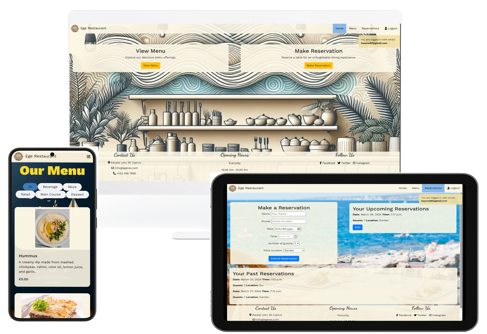

Portfolio 4 project as part of the Diploma in Full Stack Software Development by Code Institute.
___

It is a fullstack restaurant website that showcases the menu and allows users to create an account, make and edit reservations.

Link to live site - [Ege Restaurant Deployed link](https://ege-restaurant-9c7a6a3b1543.herokuapp.com/)

## CONTENTS

- [Ege Restaurant](#ege-restaurant)
- [My Girlfriends Dream Restaurants Website](#my-girlfriends-dream-restaurants-website)
- [CONTENTS](#contents)
- [Strategy Plane](#strategy-plane)
  - [Target Audience](#target-audience)
  - [Site Goals](#site-goals)
- [Scope Plane](#scope-plane)
  - [Necessary Features](#necessary-features)
  - [Nice to have Features](#nice-to-have-features)
- [Structure Plane](#structure-plane)
  - [User Authentication](#user-authentication)
  - [Reservation Management](#reservation-management)
  - [Menu Interaction](#menu-interaction)
  - [Additional Features](#additional-features)
  - [New Visitor Goals](#new-visitor-goals)
  - [Existing Visitor Goals](#existing-visitor-goals)
- [Design Choices](#design-choices)
  - [Colour Scheme](#colour-scheme)
  - [Typography](#typography)
  - [Logo and Favicon](#logo-and-favicon)
  - [Wireframes](#wireframes)
  - [Accessibility](#accessibility)
  - [Database Plan](#database-plan)
- [Features](#features)
  - [Home](#home)
  - [Authentication](#authentication)
  - [Menu](#menu)
  - [Reservations](#reservations)
  - [Custom Error Pages](#custom-error-pages)
  - [Future Implementations](#future-implementations)
- [Agile](#agile)
- [Technologies Frameworks, Libraries & Programs Used](#technologies-frameworks-libraries--programs-used)
  - [Frameworks, Libraries, and Packages](#frameworks-libraries-and-packages)
  - [Other Programs Used](#other-programs-used)
- [Testing](#testing)
- [Deployment](#deployment)
  - [Create Repository](#create-repository)
  - [Project Setup](#project-setup)
  - [Database Setup](#database-setup)
  - [Cloudinary Setup](#cloudinary-setup)
  - [File Changes](#file-changes)
  - [Heroku Setup](#heroku-setup)
  - [Forking](#forking)
- [Credits](#credits)
  - [Acknowledgements](#acknowledgements)
  - [Content](#content)
  - [Media](#media)

___

## Strategy Plane

The core objective for Ege Restaurant's website is to enhance the dining experience by enabling customers to make detailed reservations easily, view the menu, and interact with the restaurant efficiently online. This project aims to provide a seamless reservation system, showcase the restaurant's menu, and enable the admin to manage reservations and menu items effectively.

### Target Audience

-  Individuals who are seeking a high-quality Mediterranean dining experience in Cyprus. Anyone looking to make online reservations for this restaurant. 
- Restaurant owners

### Site Goals

-  Develop a user-friendly website that allows for easy navigation and interaction.
-  Implement an efficient online reservation system that simplifies the booking process for customers.
-  Showcase the restaurant's Mediterranean cuisine through a detailed and visually appealing menu.
-  Provide the restaurant's administration with tools to manage reservations, menu items, and customer interactions effectively.

## Scope Plane

Focusing on essential features that need to be implemented for a functional and effective website, we categorize them into must-have and nice-to-have, guided by MoSCoW prioritization.

### Necessary Features (Must-Have):
User authentication for reservation management.
A dynamic reservation system that allows customers to book tables online.
A comprehensive menu display, including descriptions and images of the dishes.
An admin dashboard for managing reservations, menu items, and viewing reservation statistics.

### Nice-to-Have Features:
Notification system for reservation actions.
Email SMTP setup for sending confirmation and promotional emails.
Waiting list functionality for fully booked dates.
Special request management during the reservation process.

## Structure Plane
With the features defined, I have outlined the user stories, mapping out the interactions users will have with the website. A more detailed version of these user stories can be found here. [Issues page of Ege Restaurant github](https://github.com/redifo/ege-restaurant/issues)

### User Authentication

| User Story                                                                                                           | Priority       |
|----------------------------------------------------------------------------------------------------------------------|----------------|
| As a new user, I want to register on the website, so I can manage my reservations.                 | **MUST HAVE**  |
| As an existing user, I want to log in and out of my account, to access my dashboard.         | **MUST HAVE**  |

### Reservation Management

| User Story                                                                                                           | Priority       |
|----------------------------------------------------------------------------------------------------------------------|----------------|
| As a user, I want to make a reservation, to ensure I have a table.                | **MUST HAVE**  |
| As a user, I want to view, update, and cancel my reservations, for flexibility.         | **MUST HAVE**  |
| As a user, I want to select a specific seat or area, for a personalized experience.         | **SHOULD HAVE**  |
| As a user, I want to be notified of reservation actions, for up-to-date information.        | **COULD HAVE**  |

### Menu Interaction

| User Story                                                                                                           | Priority       |
|----------------------------------------------------------------------------------------------------------------------|----------------|
| As a user, I want to browse the menu, to explore the dishes offered.                | **MUST HAVE**  |
| As an admin, I want to manage menu items, to keep the menu current.        | **SHOULD HAVE**  |

### Additional Features

| User Story                                                                                                           | Priority       |
|----------------------------------------------------------------------------------------------------------------------|----------------|
| As a user, I want to join a waiting list, for the opportunity to dine on busy days.               | **COULD HAVE**  |
| As a user, I want to make special requests with my reservation, for customized service.       | **COULD HAVE**  |

### New Visitor Goals

- Quickly grasp what the site and content is about.
- Navigate the website effortlessly to explore menu options and reservation details.
- Register for an account to manage reservations and receive updates.

### Existing Visitor Goals

-  Log into their account seamlessly.
-  Review their reservation history and manage future reservations.

# Design Choices

## Colour Scheme

#F1DFA2 (Cream): This soft cream color forms the background of various sections, offering a warm and inviting ambiance that's easy on the eyes.
#FCF6E4 (Off-White): Used for background highlights and to create a clean, uncluttered look, enhancing the content's readability.
Accent Colours:
#F8DA2E (Sunflower Yellow): Used for menu title to draw attention.
#519CEB (Sky Blue): Indicates active page links and button hovers, adding a refreshing contrast against the warmer tones.
Text:
#000000 (Black): Provides excellent readability against the lighter background shades, used for the majority of the text.
This colour scheme was selected to balance warmth and energy, creating an inviting digital environment that's both aesthetically pleasing and functional. The use of contrasting colours for interactive elements ensures users can easily navigate and interact with the website.

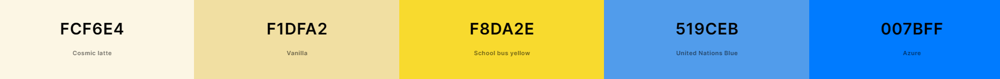

## Typography

For the website, I chose two main fonts to make it look modern and easy to read. I used 'Work Sans' for the main text because it's clean and straightforward, which helps with reading on screens. Then, for the titles in the footer, I picked 'Dancing Script' because it's a bit more decorative and adds some personality to the footer. These choices help make the site feel welcoming and easy to navigate.

## Logo and Favicon

Logo is generated by dalle-3 using the prompt :  "generate a logo for a mediterranean  restaurant, the name of the restaurant is ege"

Favicons created using: https://favicon.io/favicon-converter/


## Wireframes

Wireframes were created for mobile and desktop using [wireframe.cc](https://wireframe.cc/). For other devices wireframes were not seen as a necessity. Wireframes for other pages were not developed before development.


## Accessibility

I have been mindful during coding to ensure that the website is as accessible friendly as possible. This has been have achieved by:

* Giving all buttons a hover state to enhance the user experience by making the navigation elements responsive, ensuring that users are aware of clickable elements and encouraging engagement with the website's content.
* Choosing a sans serif font for the website - sans serif fonts are known by their easy readability.
* Making sure that there is sufficient colour contrast.

## Database Plan

The database for the restaurant website consists of four main models: Table, Reservation, SpecialRequest, and MenuItem, along with an Email model for managing emails. Although the email setup could not implemented for the project submission due to time constraints.

Table: Represents restaurant tables, specifying their number, capacity, and location (Garden, Bar, or Dining Room). This helps manage seating arrangements.
Reservation: Links customers (registered or not) to table bookings, recording details like email, phone, name, date, time, number of guests, and table location. It allows for tracking both pending and confirmed reservations.
SpecialRequest: Captures any special requests associated with a reservation, with approval option for admin managemenet. This enhances customer service by attending to specific needs.
MenuItem: Details the food items on the menu, categorized by type (e.g., Starter, Meze, Main Course), including descriptions, prices, availability, and images. This model aids in menu management and presentation.
Email: Handles the creation of emails for different purposes, with fields for recipient, subject, body, and template type, automating communication with customers.

The database diagram was created using https://dbdiagram.io/.

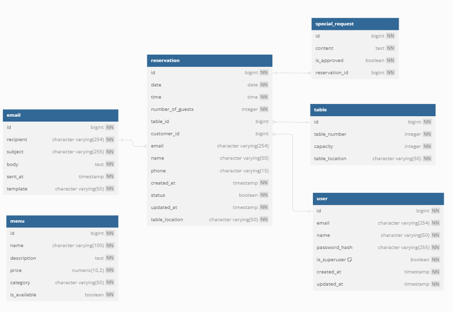

# Features
## Home

The home screen is kept simple with two buttons, "View Menu" and "Make a Reservation," for a clear and focused user experience, guiding users to essential actions without overwhelming them.

## Authentication

For authentication in my project, I've utilized the AllAuth package. Custom CSS was applied to style the forms according to the design aesthetics.

User Registration:

To create an account, users are prompted to provide their email, username, and password. Clear password requirements are displayed, and in case of invalid input, users receive immediate feedback.

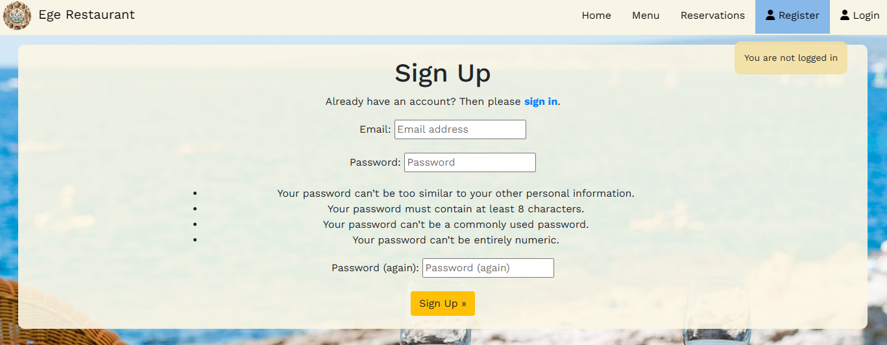

Login:

Users can access the login page to input their credentials. Upon successful login, they are redirected to the homepage. A success message confirms their action.

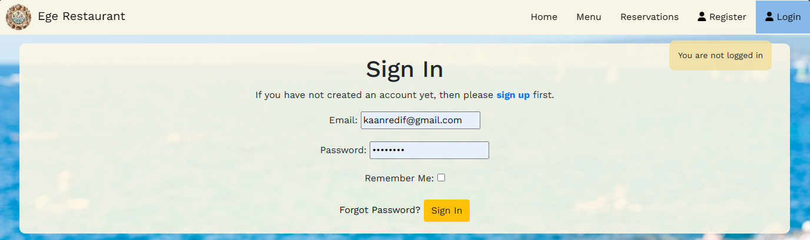

Homepage:

After logging in, users are redirected to the homepage. Here, they receive a message confirming their action (signing in or out).

Logout:

Users can choose to log out, which triggers a redirection to the homepage with a corresponding success message. Logout page did not have a go back button by default so i have added a button that triggers the goback button on the browsers. 

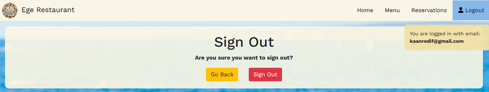

This setup ensures a seamless authentication experience with concise feedback for user actions.

## Menu

For the menu page on my website, I've implemented HTML, CSS and Js (filtering) designs inspired by this source [source](https://themewagon.github.io/feane/index.html) for a visually appealing look and efficient filtering method for menu items. The images of the menu items are stored on Cloudinary, allowing for easy editing of each menu item, including uploading photos directly from the admin panel. All CRUD (Create, Read, Update, Delete) operations for menu items are exclusively managed through the admin panel.

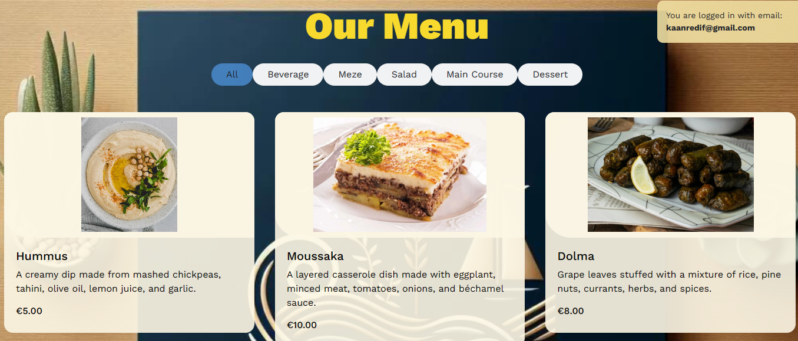

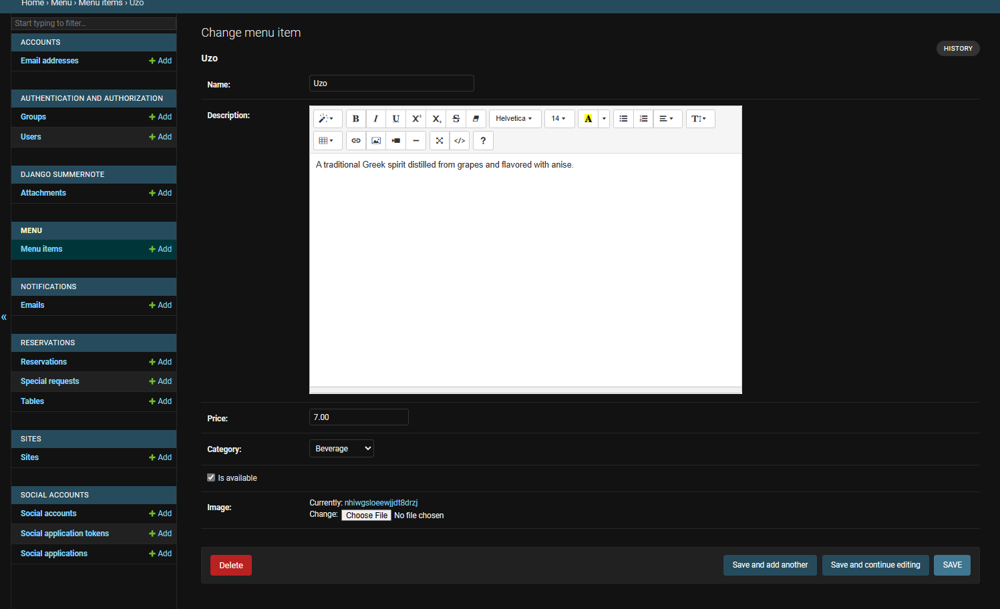

## Reservations

This page serves as a centralized platform for managing reservations efficiently. Below, we've outlined the key features and functionalities available on this page:

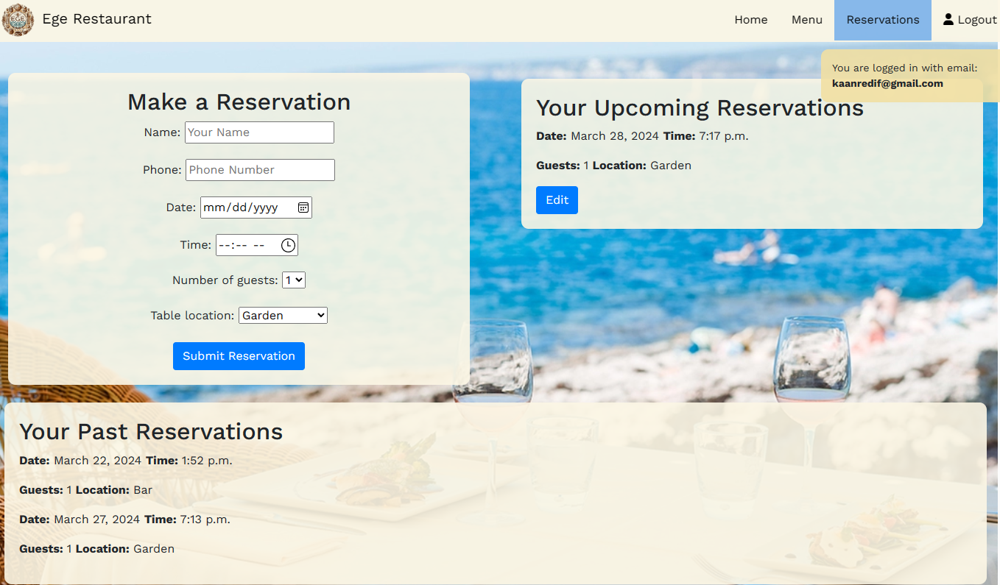

Features:

Make a Reservation Form:

Users can easily make new reservations using the intuitive reservation form.
The form includes fields for inputting reservation details such as date, time, number of guests, and preferred location.
Upon submission, users receive real-time feedback messages, such as success or error alerts. If the user is logged in, the email field is automatically filled and hidden.

Upcoming Reservations Section:

Authenticated users can view a list of their upcoming reservations.
Each reservation entry displays essential details such as date, time, number of guests, and location.
Users have the option to edit their upcoming reservations directly from the page.

Past Reservations Section:

Users can also access a list of their past reservations.
Similar to the upcoming reservations section, past reservation entries include date, time, number of guests, and location details but has no edit option

Special Requests Integration:

Customers can submit special requests along with their reservations.

Authentication Handling:

Authenticated users have access to both upcoming and past reservations, ensuring a personalized experience.
Unauthenticated users are prompted to log in before accessing reservation-related functionalities, maintaining security and privacy.

## Custom Error Pages

For the 403.html page, I've created a custom error page because I wasn't satisfied with the default one. This page informs users that they are not authorized to view the current page. It features a simple design with a background image and a message indicating the unauthorized access.

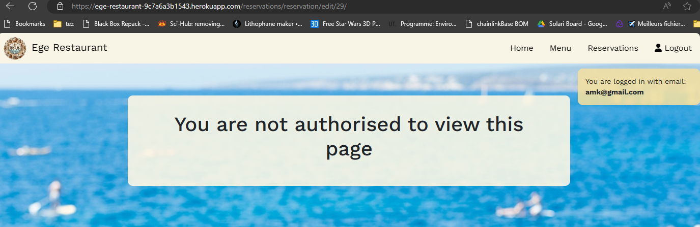

For the 500.html page, I created it to gain more information regarding a deployment issue. This error page provides users with details about the error encountered during deployment. It displays the type and value of the exception, along with the traceback information. This helps in diagnosing and troubleshooting deployment issues more effectively.

Overall, both custom error pages serve specific purposes: one addresses authorization issues, while the other assists in diagnosing deployment errors.

## Future Implementations

Table Selection with Top View of Restaurant:

Enhance user experience by implementing a visual representation of the restaurant layout.
Provide users with a top view of the restaurant's tables, allowing them to select available tables visually.
Mark booked tables with color codes to indicate their status.

Waitlist for Fully Booked Times:

Implement a waitlist feature for times when all tables are fully booked.
Allow users to join a waitlist for their desired booking time.
Notify users when a table becomes available or offer alternative booking options.

Integration of Email Functionality:

Integrate email functionality for sending notifications to users.
Notify users about their successful reservations, waitlist updates, and other relevant information.
Implement email notifications for password reset requests to enhance security and user experience.

Preventing Overbooking with Capacity Checks:

Implement a capacity check system to prevent overbooking of tables.
Check the capacity of tables in real-time when users attempt to book a table.
Display warnings or restrict bookings if the selected table or location is at full capacity.
Utilize AJAX for dynamic data viewing to provide users with instant feedback on table availability and capacity.

## Agile

I employed an agile methodology using GitHub Projects Board to organize my project. I categorized features into created User Stories, prioritizing them with MoSCoW prioritization. Custom labels were utilized for issue types and Story Points. User Stories, along with tasks, were added to the board. Sprint-wise, I used milestones, adding issues to the current sprint and moving them accordingly, although in the end i was behind schedule end stopped using sprints after sprint 3. Despite encountering hurdles like changes in database plans and tool limitations, I kept focusing on tasks and adaptations as needed. The agile approach facilitated iterative development, ensuring steady progress and adaptability to challenges.

[Project Board](https://github.com/users/redifo/projects/3)

[Issues](https://github.com/redifo/ege-restaurant/issues?q%3Dis%3Aissue%2Bis%3Aclosed)


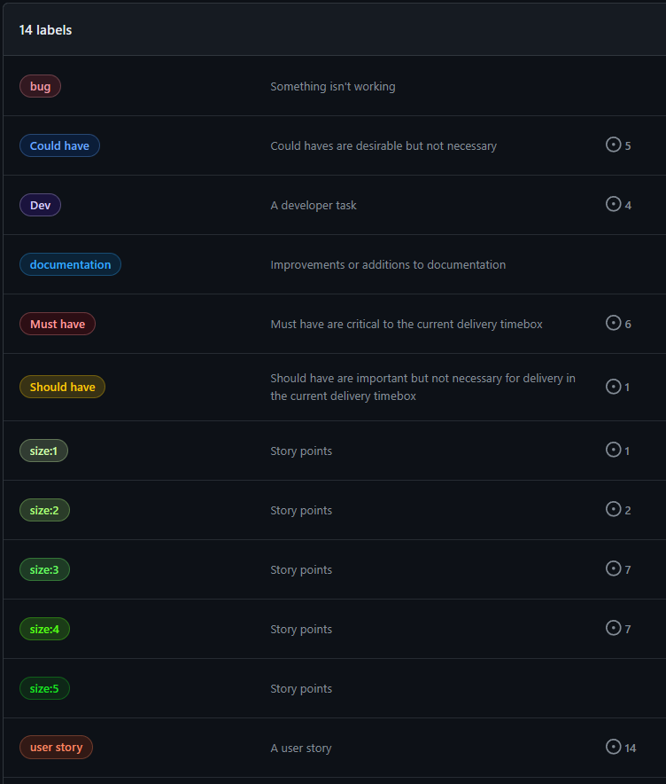

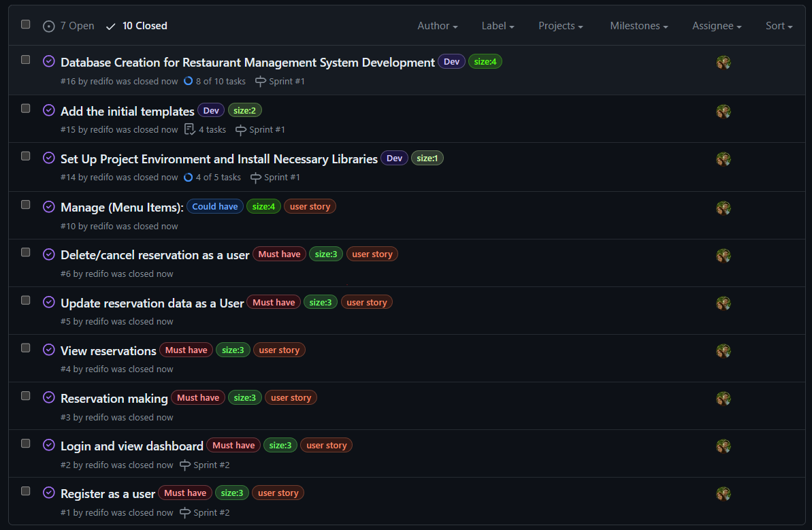

## Technologies Frameworks, Libraries & Programs Used

### Frameworks, Libraries and packages
*  [django](https://www.djangoproject.com/) - High-level Python Web framework.
*  [Bootstrap v4.6.2]() - Front-end framework for developing responsive and mobile-first websites
*  [JQuery v3.7.1](https://jquery.com/) - Fast, small, and feature-rich JavaScript library, simplifying client-side scripting.
*  [isotope](https://isotope.metafizzy.co/) - JavaScript library for filtering, sorting, and laying out elements in dynamic grid layouts.
*  [fontawesome](https://fontawesome.com/) - Comprehensive collection of icons and symbols for web development.
*  [gunicorn](https://pypi.org/project/gunicorn/) - Python WSGI HTTP Server for UNIX.
*  [psycopg2](https://pypi.org/project/psycopg2/) - PostgreSQL database adapter.
*  [whitenoise](https://pypi.org/project/whitenoise/) - static file serving for Python web apps.
*  [django-allauth](https://docs.allauth.org/en/latest/) - authentication, registration, account management.
*  [cloudinary](https://pypi.org/project/cloudinary/) -  Image storage.

### Other Programs Used

* [wireframe.cc](https://wireframe.cc/) - Used to create wireframes.

* [Bing.com Dall-e](https://www.bing.com/images/create/?ref=hn) - Used to create all the images within the website except menu items.

* [Git](https://git-scm.com/) - For version control.

* [Github](https://github.com/) - To save and store the files for the website.

* [Google Fonts](https://fonts.google.com/) - To import the fonts used on the website.

* [Google Developer Tools](https://developers.google.com/web/tools) - To troubleshoot and test features, solve issues with responsiveness and styling.

* [Favicon.io](https://favicon.io/) To create favicon from the logo created by Dall-e 3.

* [Canva.com](https://www.canva.com/) To edit some of the images generated by dalle-3 and to create the responsive mockup view.
  
* [convertio.co](https://convertio.co) To covert images into webp format.

* [Webpage Spell-Check](https://chrome.google.com/webstore/detail/webpage-spell-check/mgdhaoimpabdhmacaclbbjddhngchjik/related) - a google chrome extension that allows you to spell check your webpage. Used to check the site and the readme for spelling errors.

- - -
# **Testing**

Please refer to the separate [TESTING.md](TESTING.md) file.

# **Deployment**

Here is the link to the deployed project. [Ege Restaurant Deployed link](https://ege-restaurant-9c7a6a3b1543.herokuapp.com/).

## **Create Repository**

First, create a new repository on GitHub. i have used the [Code Institute Template](https://github.com/Code-Institute-Org/ci-full-template). 

If working locally, set up a virtual environment and open your project in your IDE. For virtual environment setup, you can use the command python -m venv .venv.

## **Project Setup**

Below, I have mentioned the versions of the libraries used to prevent any version compability issues.

1. Install **Django** and **gunicorn**:
   - `pip install Django==5.0.3 gunicorn==20.1.0`
2. Install supporting **libraries**:
   - `pip install dj-database-url==0.5.0`
   - `pip install cloudinary~=1.36.0 dj3-cloudinary-storage~=0.0.6 urllib3~=1.26.15`
   - `pip install psycopg2==2.9.9`
   - `pip install django-allauth==0.57.2`
   - `pip install django-summernote==0.8.20.0`
   - `pip install whitenoise==5.3.0`
3. Create **requirements.txt** file:
   - `pip freeze --local > requirements.txt`
4. Create a Django project:
   - `django-admin startproject your_project_name` 
5. Run the local server
   - `python manage.py runserver`
   
## **Database Setup**

For the database, I am using PostgreSQL through ElephantSQL: [ElephantSQL](https://www.elephantsql.com/).

1. Log in to your account
2. Create an instance on ElephantSQL and obtain the database URL.

## **Cloudinary Setup**

1. For Cloudinary, sign up and obtain your Cloudinary URL for media management. [Cloudinary](https://cloudinary.com/)  **API Environment variable**

## **File Changes**

In settings.py, configure your database, static files, and Cloudinary settings. Include your database URL, Cloudinary URL, and secret key in your environment variables. Set up STATICFILES_STORAGE to use whitenoise for static file management. Don't forget to configure AUTHENTICATION_BACKENDS to include both Django's default and allauth's authentication backends.

1. Although if you copy directly from my githuib repository the settings.py should come with all the changes i made, i wanted to document my changes. Changes I made in the default **settings.py** file: 
```    
import os
import dj_database_url
if os.path.isfile('env.py'):
    import env

#Got the idea of automatic debug value setting from my mentor Jubril
try:
    from env import DEBUG_DEV
except ImportError:
    DEBUG_DEV = False 

DEBUG = DEBUG_DEV

BASE_DIR = Path(__file__).resolve().parent.parent
SECRET_KEY = os.environ.get("SECRET_KEY")

#allowed hosts for local ide and heroku deployment
ALLOWED_HOSTS = ['.herokuapp.com',
                 '127.0.0.1',]

#https://docs.allauth.org/en/latest/account/advanced.html
#settings Used for email login with allauth

ACCOUNT_EMAIL_VERIFICATION = 'none'
ACCOUNT_AUTHENTICATION_METHOD = 'email'
ACCOUNT_EMAIL_REQUIRED = True
ACCOUNT_USERNAME_REQUIRED = False

STATIC_URL = '/static/'
STATICFILES_DIRS = [os.path.join(BASE_DIR, 'static'),]
STATIC_ROOT = os.path.join(BASE_DIR, 'staticfiles')

STATICFILES_STORAGE = 'whitenoise.storage.CompressedManifestStaticFilesStorage'
DATABASES = {
    'default': dj_database_url.parse(os.environ.get("DATABASE_URL"))
}

#https://haiiiiiyun.github.io/django__Create_email_login_authentication_with_django-allauth_in_Django/

#Don't forget to configure AUTHENTICATION_BACKENDS to include both Django's default and allauth's authentication backends.

AUTHENTICATION_BACKENDS = [
    'django.contrib.auth.backends.ModelBackend',  
    'allauth.account.auth_backends.AuthenticationBackend',
]

#check your installed app settings against my settings
INSTALLED_APPS = [
    'django.contrib.admin',
    'django.contrib.auth',
    'django.contrib.contenttypes',
    'django.contrib.sessions',
    'django.contrib.messages',
    'django.contrib.staticfiles',
    'cloudinary_storage',
    'django.contrib.sites',
    'allauth',
    'allauth.account',
    'allauth.socialaccount',
    'django_summernote',
    'menu',
    'reservations',
    'home',
    'django_rename_app',
    'cloudinary',
    'notifications',
    ]

#Templates directory code change
TEMPLATES_DIR = os.path.join(BASE_DIR, 'templates')
TEMPLATES = [
    {
        'BACKEND': 'django.template.backends.django.DjangoTemplates',
        'DIRS': [TEMPLATES_DIR],
        .
        .
        .
        },
]
```   

2. Create a **env.py** file in your main directory copy the contents below into your file. Make sure the file is added to *.gitignore*:
    ```
    import os

    DEBUG_DEV=True

    os.environ.setdefault("DATABASE_URL", "Your_url")

    os.environ.setdefault("SECRET_KEY", "Your_url")

    os.environ.setdefault("CLOUDINARY_URL", "Your_url")
    ```
3. After these changes, run `python manage.py migrate` to migrate your database structure to the database.

## **Heroku Setup**

1. Create a Heroku app.
2. Link your GitHub repository to Heroku.
3. Select your created app and open the *Settings* tab 
4. At the *Config Vars* section click *Reveal Config Vars* and add the following:
   - **DATABASE_URL** with the copied URL from ElephantSQL
   - **SECRET_KEY** with your secret key
   - **PORT** with the value 8000
   - **CLOUDINARY_URL** with the copied URL from Cloudinary
5. Click on *Deploy Branch* at the bottom of the page

## **Forking**

Forking creates a copy of the project on GitHub. Follow these steps to fork this repository:
1. Log in to your GitHub account and navigate to [Ege restaurant Repository]().
2. Click the **Fork** button on the top right of the repository.
3. You can now open the forked copy of this project as your own repository.
4. Look through the steps mentioned above to confidently work on the project.

Remember to replace placeholder texts with specific instructions related to your project setup. This guide should help in successfully deploying your Django restaurant website to Heroku, with PostgreSQL as your database and Cloudinary for managing menu item media files.

# **Credits**

## **Acknowledgements**

I want to thank my girlfriend for always supporting and giving feedback on this project. Her role as a real-life customer has been incredibly helpful.

I want to thank Jubril Akole, for guiding me and sharing his expertise. 

## **Content**

The contents of these URLs were used as a reference when creating the authentication system with email login in Django. Later, I also wanted to create a custom user model that extends the built-in version but this required either complete deletion of migration and database files or careful removal of certain dependencies (migration applied before its dependency error) within the migration files so I didn't include this model in my website.

- [django__Create_email_login_authentication_with_django-allauth_in_Django](https://haiiiiiyun.github.io/django__Create_email_login_authentication_with_django-allauth_in_Django/)
- [django-allauth Documentation - Advanced](https://docs.allauth.org/en/latest/account/advanced.html)
- [Django Custom User Model Tutorial](https://learndjango.com/tutorials/django-custom-user-model)
- [Stack Overflow - Django `manage.py migrate` applied before its dependency](https://stackoverflow.com/questions/38996599/django-manage-py-migration-applied-before-its-dependency)

The content below was used as a reference when creating choice options within the `models.py` files.
- [Django Model Field Reference](https://docs.djangoproject.com/en/5.0/ref/models/fields/)

The content below was used as a reference when creating custom forms.
- [Django Form Widgets Reference](https://docs.djangoproject.com/en/5.0/ref/forms/widgets/)
- [Django ModelForms Documentation](https://docs.djangoproject.com/en/5.0/topics/forms/modelforms/#django.forms.ModelForm)

The content below was used as a reference for the creation of the menu page. Some of the HTML and CSS code for the menu item boxes and some of the JavaScript for the filtering method used on the menu page were directly copied from this source.
- [Feane Theme](https://themewagon.github.io/feane/index.html) 
- [Feane Theme GitHub Repository](https://github.com/themewagon/feane)

## **Media**

Background images and logos have been created by dalle-3 (bing). All other images were gathered from [pexels](https://www.pexels.com/)