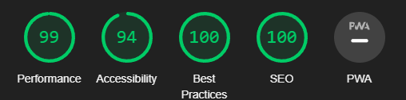

# **Testing**

[Go back to the README](README.md)

## **Table of Contents**

* [**Testing**](#testing)
  * [**Table of Contents**](#table-of-contents)
  * [**User-based restrictions**](#user-based-restrictions)
  * [**Manual Testing**](#manual-testing)
  * [**Lighthouse Testing**](#lighthouse-testing)
  * [**Validation**](#validation)
    * [**HTML Validation**](#html-validation)
    * [**CSS Validation**](#css-validation)
    * [**JavaScript Validation**](#javascript-validation)
    * [**Python Validation**](#python-validation)
  * [**Bugs and Fixes**](#bugs-and-fixes)

## User-Based Restrictions

During testing, I discovered a vulnerability where users could manipulate reservation data by manually typing reservation IDs into the browser URL. This posed a security risk as users could potentially edit reservations that weren't theirs. To address this issue:

Manual Reservation ID Entry: Identified that users could manipulate reservation data by manually typing reservation IDs into the browser URL.
Edit Reservation View (views.py): Implemented a validation check within the edit_reservation view to ensure that only the owner of the reservation could edit it. Added logic to verify the user's ownership before allowing any modifications.
Custom 403 Template: Created a custom 403 template to handle unauthorized access attempts. This template specifically addresses the issue of users attempting to edit reservations that they don't own, providing a clear message and preventing any unauthorized actions.
By implementing these measures, user-based restrictions have been enforced to ensure data integrity and protect user privacy within the reservation system.

## Manual testing

### Admin Testing

| TEST                                             | OUTCOME                                                    | PASS/FAIL |
|--------------------------------------------------|------------------------------------------------------------|-----------|
| Create Menu Item                                 | Menu item successfully created and displayed               | Pass      |
| Edit Menu Item                                   | Menu item details updated successfully                     | Pass      |
| Delete Menu Item                                 | Menu item deleted successfully                             | Pass      |
| Create User                                      | User successfully created and displayed                    | Pass      |
| Edit User                                        | User details updated successfully                          | Pass      |
| Delete User                                      | User deleted successfully                                  | Pass      |
| Create Reservation                               | Reservation successfully created and displayed             | Pass      |
| Edit Reservation                                 | Reservation details updated successfully                    | Pass      |
| Delete Reservation                               | Reservation deleted successfully                           | Pass      |
| Create Table                                     | Table successfully created and displayed                   | Pass      |
| Edit Table                                       | Table details updated successfully                         | Pass      |
| Delete Table                                     | Table deleted successfully                                 | Pass      |

### User Testing

| TEST                                             | OUTCOME                                                    | PASS/FAIL |
|--------------------------------------------------|------------------------------------------------------------|-----------|
| Create Account | Created successfully | Pass |
| View Menu Items | Menu items displayed correctly | Pass |
| Create Reservation | Reservation successfully created and displayed | Pass |
| Form validation when Creating Reservations (Name field) | The name field cant be shorter than 3 characters, cant have special characters and displays the corresponding error message | Pass |
| Edit Own Reservation | Own reservation details updated successfully | Pass |
| Edit someoneelses Reservation by typing in the reservation id manually into the address bar | Custom 403 template loads | Pass |
| Delete Own Reservation | Own reservation deleted successfully | Pass |

### Website General Features Testing

| TEST                                             | OUTCOME                                                    | PASS/FAIL |
|--------------------------------------------------|------------------------------------------------------------|-----------|
| All Buttons Functionality                        | Buttons perform their intended actions                      | Pass      |
| External Links Behavior                          | External links open in new window/tab                       | Pass      |
| Navigation Menu                                 | Navigation menu items lead to correct pages                 | Pass      |
| Responsive Design                               | Website layout adjusts appropriately across devices          | Pass      |
| Error Handling                                  | Proper error messages displayed and handled gracefully      | Pass      |
| Image Loading                                   | Images load correctly and promptly                           | Pass      |

## **Lighthouse Testing**

After mostly finishing website i ran lighthouse tests for all main pages for mobile and desktop. 
After seeing that blue buttons lowered accesibility ratings, I have changed the defualt bootstrap btn-primary buttons to btn-warnings. 

Lighthouse also marked my headings in the footer for not following order but after carefully checking decided to ignore this accessibilty issue. 

The cloudinary images were rasing warnings in the console for mixed content and lighthouse ofcourse marked this as a problem. The problem was caused by images from cloudinary being loaded over http instead of https. I couldnt figure out the source of the problem by internet searches and after checking that the menu item urls were stored without the https tag infront of the url in the databse. The images were being called with the http tag infront when i call them with item.url. To fix this i have written an if statement within the html that slices that http infront and adds https. 

Lighthouse scores for each main page:

*Lighthouse score home (desktop)*

*Lighthouse score home (mobile)*

*Lighthouse score login (desktop)*

*Lighthouse score login (mobile)*

*Lighthouse score reservation (desktop)*

*Lighthouse score reservation (mobile)*

*Lighthouse score menu (desktop)*

*Lighthouse score menu (mobile)*

*Lighthouse score register (desktop)*

*Lighthouse score register (mobile)*

Menu page lower scores were mainly caused by cloudinary  images, which are not under my control and cannot be optimized further. The load times were giving mixed results for these images and these were also causing best practices errors even though i fixed the mixed content issue. 

*Lighthouse score menu problems*

## **Validation**

### **HTML Validation**

I used the [HTML W3C Validator](https://validator.w3.org/) to validate all of my HTML files. I validated each page of the application by using the check by address option in the validator and pasting all my deployed sites urls.

No errors were found for all my pages

### **CSS Validation**

I used the [W3C CSS Validator](https://jigsaw.w3.org/css-validator/) to validate my CSS code. My custom CSS code was validated without errors.

### **JavaScript Validation**

[JSHint](https://jshint.com/) was utilized to evaluate the JavaScript code in my project. In order to address warnings related to ES6 variables, I included `/* jshint esversion: 6 */` as a comment at the beginning of JSHint. Additionally, to avoid warnings stemming from the usage of jQuery, `/*globals $:false */` was incorporated.

My project comprises two JavaScript files: `main.js` and `menu.js`. 

The `main.js` file contains JavaScript code for go back button function and automatic year retrival for footer. Upon validation using JSHint, only one warning appeared that says one unsued variable.

*JS validation result for main.js*

The `menu.js` file encompasses JavaScript code specific to the menu filter functionality. Following evaluation with JSHint, no errors or warnings were identified in the `menu.js`

### **Python Validation**

To ensure my Python code follows best practices and maintains readability, I used the [PEP8CI](https://pep8ci.herokuapp.com/) tool. Here's what I found:

- Trailing Whitespaces: I discovered many trailing whitespaces in the code, which I removed to keep it clean and consistent.
- Single Line of Gap: Some sections lacked the recommended two lines of gap between code blocks, so I added the necessary spacing for clarity.
- Line Too Long Errors: While I managed to address many line too long errors, some instances remained unresolved due to the nature of the code.

*Some example of pep8 validation results*

These efforts aimed to enhance the quality and maintainability of the Python codebase.

## **Bugs and Fixes**

Issue with internal error on deployment due to static files
Problem Description:
Images called using the  method work correctly in local development but fail to load on Heroku deployment. The application throws an internal error, and the logs display the following error message: ValueError: Missing static files manifest entry for '/img/reservation-bg.webp'. This issue occurs not only with the specific image mentioned in the error but also with every image called using the  method. Pages that do not utilize this method load normally on Heroku.

Investigation Steps:
Reviewed the documentation for Whitenoise to ensure correct configuration. Tried switching from ManifestStaticFilesStorage to default Django storage but the issue persisted. [Whitenoise Documentation](https://whitenoise.readthedocs.io/en/stable/django.html)
Downgraded Django version to 4.1 to rule out version compatibility issues. However, the problem persisted.
Verified that other static files such as JavaScript load correctly on the affected pages.
Observed that changing image paths to relative paths to the static folder resolves the issue.
Resolution Steps:
To resolve this issue:

Change image paths to relative paths to the static folder instead of using the  method.
Additional Notes:
Further investigation is needed to determine the root cause of the issue with the  method on Heroku deployment. This workaround provides a temporary solution but does not address the underlying problem.

